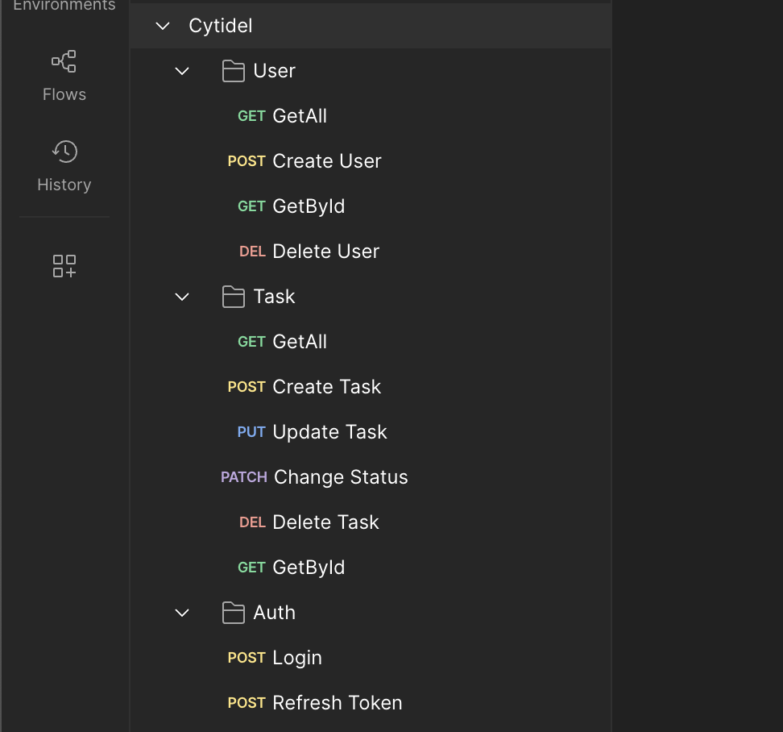
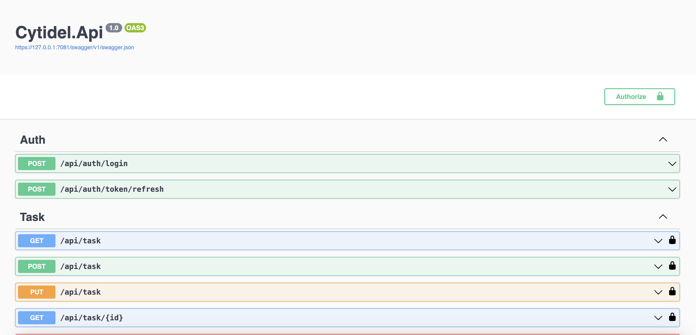
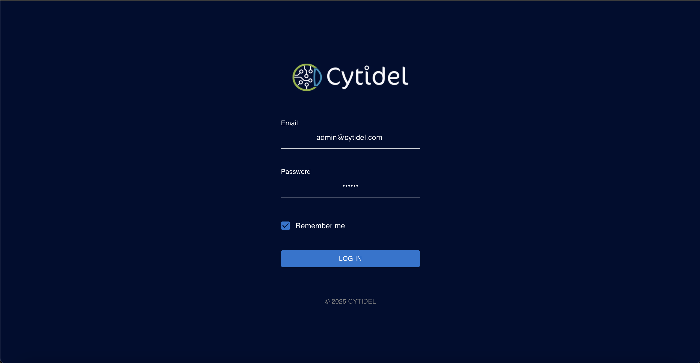
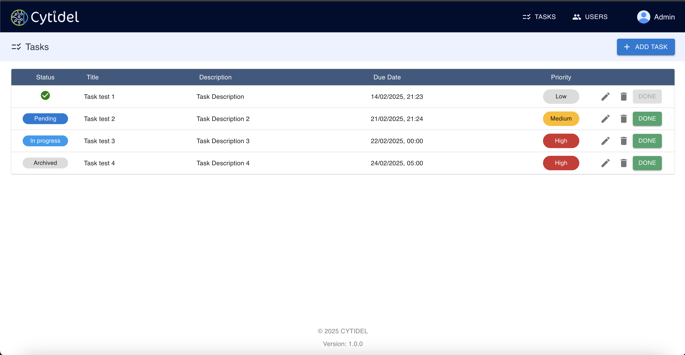
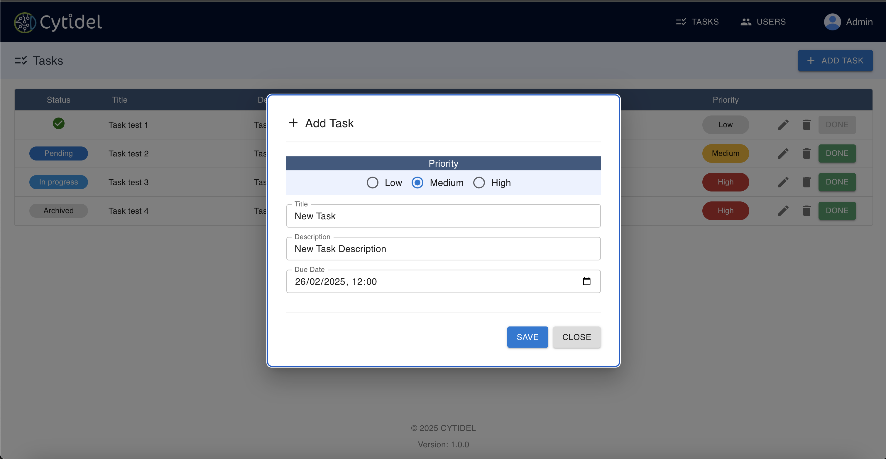
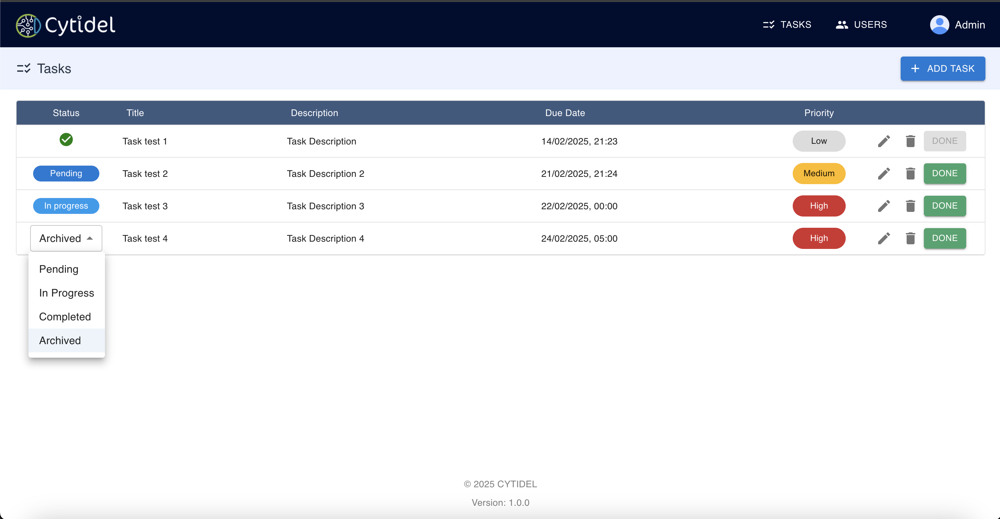

# Code Challenge - Backend (.NET 8.0) and Frontend (React + Material UI)

### Overview

This repository contains a simple code challenge showcasing a backend built with .NET 8.0 and a frontend built with React using Material UI. The main goal of this project is to demonstrate a basic yet functional full-stack application.

### Technologies Used

.NET 8.0 (C#)
ASP.NET Core for the backend REST API
React for the frontend
Material UI for component styling and layout
Fetch for API requests
Node.js (runtime environment for React app)
npm or yarn (package manager)

### Requirements

- .NET 8.0 SDK or higher
- Node.js (version 16+ recommended)
- npm or yarn

### Getting Started

1. __Clone the Repository__

```
git clone https://github.com/monteirohat/cytidel.git
cd cytidel

```
2. __Run the Backend (ASP.NET Core)__
    1. Open a terminal in the backend folder.
    2. Restore and build the .NET project:
    
    ```
    dotnet restore
    dotnet build
    ```
    3. Run the backend:
    ```
    dotnet run
    ```

    4. By default, the application will start on https://localhost:7081 or a similar port. You can verify the API is running by accessing https://localhost:7081/swagger.


3. __Run the Frontend (React + Material UI)__
    1. Open a new terminal in the frontend folder.
    2. Install dependencies:

    ```
    npm install
    ```
    3. Start the development server:
    ```
    npm start
    ```
    4. By default, the React application will be available at http://localhost:3000.

### Configuration
- If necessary, adjust the API base URL in the React app in a file such as src/services/ApiService.
Example:

```
const BASE_URL = "https://127.0.0.1:7081/api";
```

### Database

For database purposes, SQLite was used, and the database file can be found at 

```
Backend/Data/Cytidel.db
```


### Usage

1. After both the backend and frontend are running, open your browser at http://localhost:3000.


### Test
1. __Backend Tests__
For backend tests, execute the command ```dotnet test```.

### Postman (WebApi)

To perform API tests via Postman, import the **"Cytidel.postman_collection.json"** file (version 2.1) directly into Postman.



### Swagger (WebApi)

https://127.0.0.1:7081/swagger/index.html



### Logins

1. __User 1__

```
Name: André Monteiro
Email: monteiro.hat@gmail.com
Password: 12345
``` 


2. __User 2__

```
Name: Admin 
Email: admin@cytidel.com
Password: 12345
``` 



### Tasks

1. __View All Tasks__


2. __Add New Task__


3. __Change Task Status__
